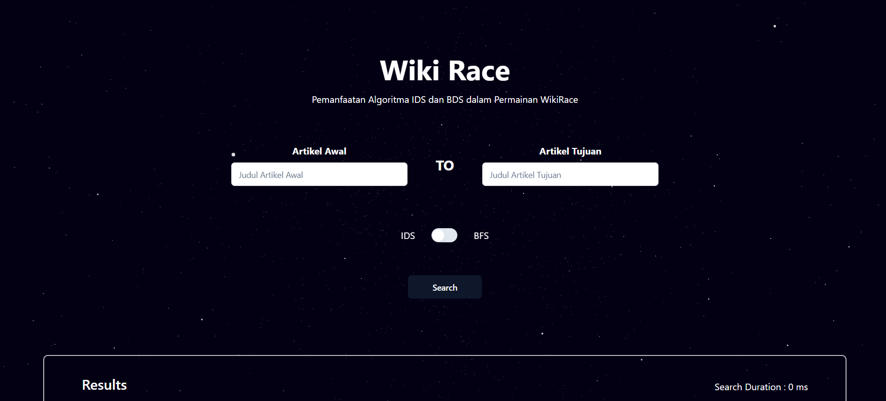

# Pemanfaatan Algoritma IDS dan BFS dalam Permainan WikiRace

#### Breadth First Search 
Breadth First Search (BFS) merupakan salah satu algoritma traversal graf yang dicirikan dengan pengecekan simpul yang level-by-level , dengan kata lain simpul yang diprioritaskan untuk dicek adalah seluruh anak dari sebuah simpul. BFS bekerja melalui prinsip First in First out (FIFO) yang berarti persoalan ini cocok diselesaikan menggunakan queue. Simpul ekspan akan membuat anak, lalu anak - anaknya akan dimasukkan ke dalam queue simpul hidup. Bila proses tersebut selesai front dari queue akan di pop untuk dijadikan simpul ekspan yang baru dan mengulang prosesnya sampai target ditemukan.

#### Iterative Depth First Search
Iterative Depth First Search (IDS)  merupakan lanjutan dari Depth First Search. Algoritma DFS akan mengunjungi suatu simpul, dan mengunjungi anak simpul itu, terus hingga ketemu simpul paling bawah tanpa anak. Setelah itu algoritma akan backtrack ke simpul terakhir yang memiliki anak dan melakukan algoritma DFS kembali. Bedanya IDS dengan DFS adalah bahwa IDS memiliki suatu aturan baru, yaitu kedalaman atau “depth” yang merupakan jarak maksimal dari simpul awal yang dicari. IDS memulai dengan depth 1 dan terus dinaikkan jika belum ditemukkan simpul tujuan

## Cara Menggunakan Program

Clone Repository
```bash
  git clone https://github.com/AtqiyaHaydar/Tubes2_PergiBahasa.git
```

Mengubah Direktori ke Folder Tubes2_PergiBahasa
```bash
    cd ./Tubes2_PergiBahasa/
```

Mengunduh Website Dependencies di Folder Front End
```bash
    cd ./frontend/
    npm install
```

Menjalankan Website di Localhost 3000
```bash
    cd ./frontend/
    npm run dev
```

Menjalankan Server Backend di Localhost 8080
```bash
    cd ./backend/
    go run main.go node.go ids.go bfs.go
```


## Tampilan Halaman Website




## Authors
- Venantius Sean Ardi Nugroho (13522078)
- Justin Aditrya Putra Prabakti (13522130)
- Atqiya Haydar Luqman (13522163)


